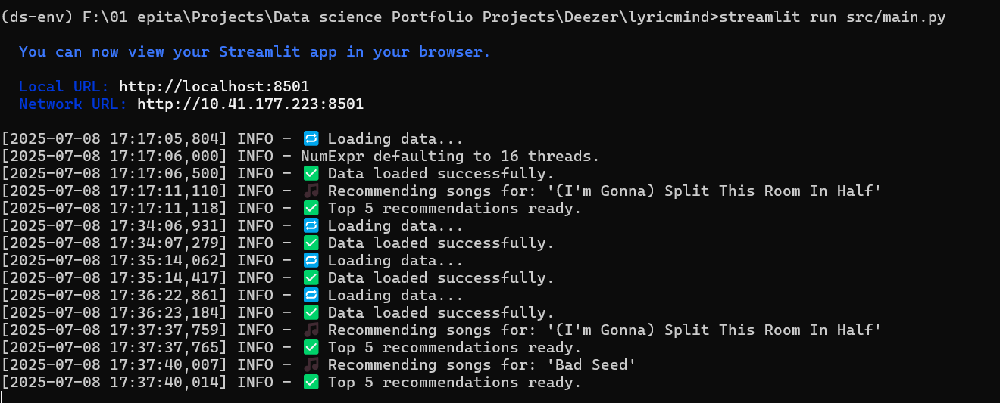
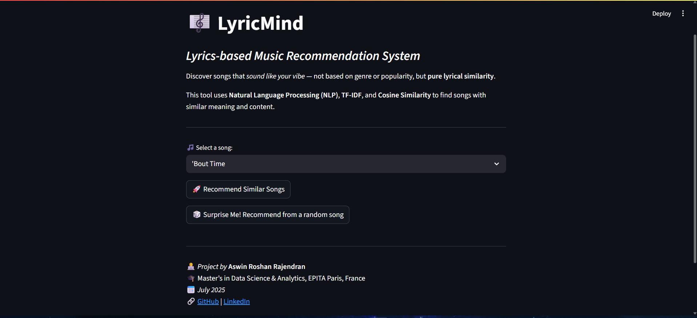
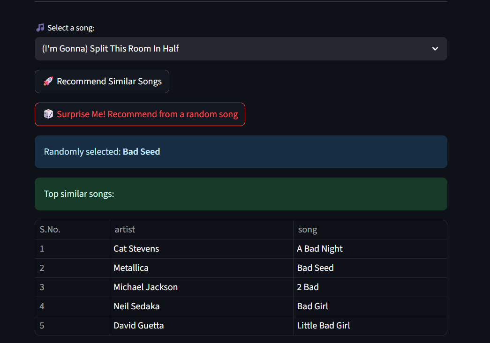

# 🎵 LyricMind - AI-Powered Music Recommendation System


LyricMind is a **NLP-based music recommendation system** that suggests similar songs based on their **lyrics**. Whether you're a music lover or data scientist, this project demonstrates how TF-IDF and cosine similarity can drive intelligent recommendations, powered by a user-friendly Streamlit interface.

> 🚀 Built with 💡 curiosity, 🎧 passion for music, and 🧠 applied machine learning!

---

## 🌟 Project Highlights

- Built using **Python**, **Streamlit**, and **scikit-learn**
- Processes and recommends songs from a large lyric-based dataset
- Utilizes **TF-IDF vectorization** + **cosine similarity**
- Cleaned and optimized data pipeline using **NLTK**
- Simple, elegant, interactive web interface

---

## 📸 Demo Screenshots

| Preprocessing Logs | Full Web App UI | Web App (Result Shown) |
|--------------------|------------------|-------------------------|
|  |  |  |

---

## 🛠 Tech Stack

- **Language**: Python 3.10+
- **Libraries**: 
  - `pandas`, `scikit-learn`, `nltk`, `wordcloud`, `joblib`
- **Web Framework**: Streamlit
- **IDE**: VS Code
- **Version Control**: Git + GitHub

---

## 🧠 How It Works

1. **Dataset**: Spotify Million Song Dataset (lyrics-based)
2. **Preprocessing**:
   - Tokenization
   - Stopword removal
   - Cleaning text with regex
3. **Feature Extraction**:
   - TF-IDF vectorization
4. **Similarity Calculation**:
   - Cosine similarity between lyric vectors
5. **Recommendation Engine**:
   - Given a song, recommend top `n` similar ones

---

## 🚀 Getting Started

```bash
# 1. Clone the Repository
git clone https://github.com/aswinroshanrajendran/lyricmind.git
cd lyricmind

# 2. Create and Activate a Virtual Environment
python -m venv ds-env
# On Windows
ds-env\Scripts\activate
# On macOS/Linux
source ds-env/bin/activate

# 3. Install Dependencies
pip install -r requirements.txt

# 4. Preprocess the Data
cd src
python preprocess.py

# 5. Launch the App
streamlit run app.py
```

---

## 📁 Folder Structure

```
lyricmind/
│
├── src/
│   ├── app.py               # Streamlit app
│   ├── recommend.py         # Recommendation logic
│   ├── preprocess.py        # Preprocessing pipeline
│   ├── spotify_millsongdata.csv   # Dataset (not tracked on GitHub)
│
├── images/
│   ├── preprocess.png       # Terminal run of preprocessing
│   ├── webapp.png           # App interface
│   ├── webapp-1.png         # App with recommendations shown
│
├── .gitignore
├── requirements.txt
└── README.md
```

---

## 🙋‍♂️ About Me

**Aswin Roshan Rajendran**  
🎓 Master's in Data Science & Analytics, **EPITA**, Paris  
📍 Paris, France  
📫 [aswinroshan17@gmail.com](mailto:aswinroshan17@gmail.com)

---

## 📜 License

This project is open-source and available under the [MIT License](LICENSE).

---

## 🤝 Acknowledgements

- Dataset: [Spotify Million Song Dataset (Kaggle)](https://www.kaggle.com/datasets/notshrirang/spotify-million-song-dataset)
- Streamlit for rapid prototyping
- NLTK and scikit-learn for awesome NLP tools
